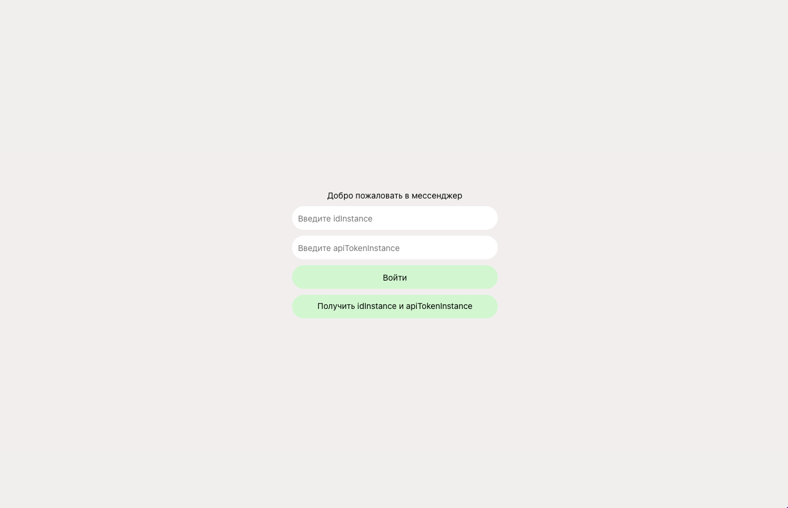

# whatsAppWeb-greenApi

Интерфейс для отправки и получений сообщений WhatsApp (только для пользователей, зарегистрированных в сервисе GREEN-API https://green-api.com/)

Открыть проект можно по ссылке: https://merdzhen.github.io/whatsAppWeb-greenApi/

Для локального запуска проекта воспользуйтесь командами:
- `npm i`,
- `npm start`

Для входа используйте idInstance и apiTokenInstance, полученные при регистрации в GREEN-API https://green-api.com/

Далее открывается окно с возможностью начать диалог:

или окно с уже начатами диалогами:

Для создания нового диалога вводите номер телефона получателя в международном формате без плюса (например 79251234567). Также есть возможность поиска диалога по номеру получателя:

После выбора нужного диалога начинайте общение :) отправляйте и получайте сообщения.

На данный момент приложение поддерживает только текстовый формат сообщений.
